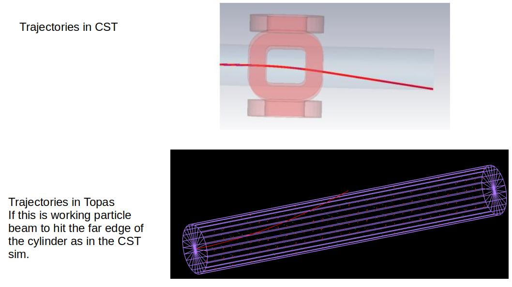
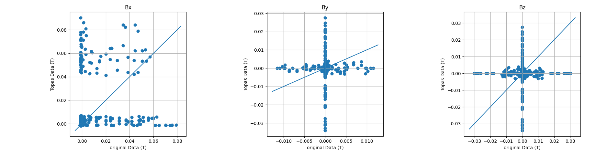
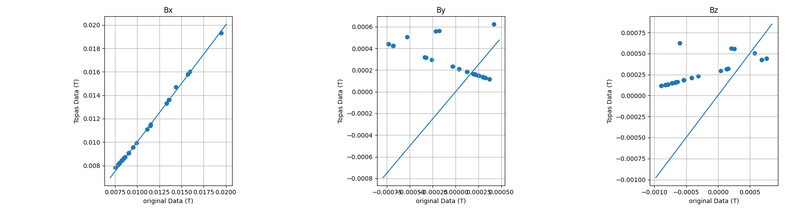

# Topas magnetic field analysis

I'm having some trouble with importing a magnetic field map into topas. 
This code is my troubleshooting.

I am putting all this code here because I am a bit stuck (see figure 1) and I am hoping someone can figure out what I have done wrong!

## The problem:

I have calculated a field map and electron trajectories in CST. I have then tried to import the field into Topas, and calculate the electron trajectories there as well.
Thus far, I have not been able to get these two fields to match:

Therefore, I tried to carry out a comparison of the original input data, to the data within topas. This also indicates that something is wrong:

I also carried out the same excercise with a simplified version of the purging magnet example supplied with topas. This looks better, but still not correct:

I realise that the most likely explanation for all this is that I've made an error somewhere, but I have tried everything I can think of and I don't know where it could be. Perhaps the two most likely causes are 
- the read out of data from topas is wrong
- I have misunderstood some coordinate systems and am accidentally comparing fields from different geographic locations

Against both of these points however is that fact that in the simplest example I can manufacture, the trajectories are still not correct. So I am stumped! 

## Directory structure

(you will find additional readme's in each folder)

1. Data: All necessary text data files. Original data is from CST, which 
is converted into the opera format for read in to topas. The topas data is
the same data read back out of topas. Unfortunately I cannot get these to match.
2. PythonAnalysis: my python code to analyse all the data
3. TopasExtensions: I've made some minor changes to the topas mapped field file
such that it prints a lot of data to the screen. 
4. TopasScripts: this contains my topas script to read in the Field data. It also contains the purgingMagnet example, which has been edited to use the topas extension above
